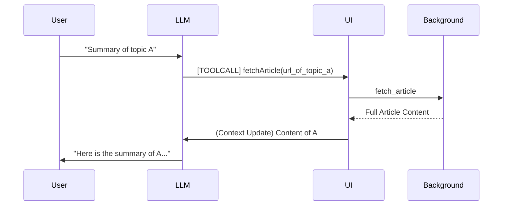

# PLAN-agentic-fetch.md - Agentic Fetch & Chain-of-Thought

## Goal
Transform the Extension from a "passive scanner" into an **Agentic Research Assistant**.
1. **Agentic Fetch**: AI can autonomously trigger `fetch_article` messages based on its internal reasoning.
2. **Chain-of-Thought (CoT)**: AI can analyze headlines within a topic, pick the best source, fetch it, evaluate it, and decide if it needs to crawl further for more detail.

## Proposed Changes

### 1. Loop Communication Model
We need a two-way loop between the UI and the LLM.

### 2. Implementation Strategy

#### [MODIFY] [llm-client.js](file:///home/emoi-user/Workspace/mini-app/ai-chatbot-injector/content/llm-client.js)
- Implement **Tool Calling** (Function Calling) simulation.
- Define `fetch_full_content(url)` as a tool the LLM can "call" by outputting a specific JSON format or special tag.

#### [MODIFY] [ui-controller.js](file:///home/emoi-user/Workspace/mini-app/ai-chatbot-injector/content/ui-controller.js)
- Handle the special "tool output" from the LLM.
- If LLM outputs `<fetch>URL</fetch>`, the `ui-controller` catches it, performs the fetch, and automatically sends a NEW request to the LLM with the fetched content.
- Implement a "thinking" state UI to show user the AI is currently researching.

#### [MODIFY] [scanner.js](file:///home/emoi-user/Workspace/mini-app/ai-chatbot-injector/content/scanner.js)
- Group articles by **Topic Cluster** (Google News groups similar stories).
- Provide the LLM with "Topic Summaries" (headlines only) and ask it to pick the best one to dive deeper.

### 3. Chain-of-Thought Prompting
Update the system prompt to:
1. "You are an Autonomous Researcher."
2. "If you need more info to answer, use `<fetch>URL</fetch>`."
3. "Evaluate multiple sources for complex topics."

## Verification Plan

### Automated/Manual Testing
- **Scenario 1**: User asks "Tell me more about the 'Hanoi unions' story". 
  - **Expected**: AI identifies the URL from context, triggers `<fetch>`, gets content, and provides a detailed answer without any user clicks.
- **Scenario 2**: Multi-source research.
  - **Expected**: AI fetches source A, realizes it's just a summary, then fetches source B for more detail.

## User Review Required
> [!IMPORTANT]
> **LLM Support**: This requires the LLM to be capable of following structured "tool calling" instructions. If the model is too small/weak, it might hallucinate tags.
> **Auto-Crawl Warning**: To prevent infinite loops or excessive bandwidth, we should cap the AI at **max 3 auto-crawls** per user request. Do you agree with this cap?
