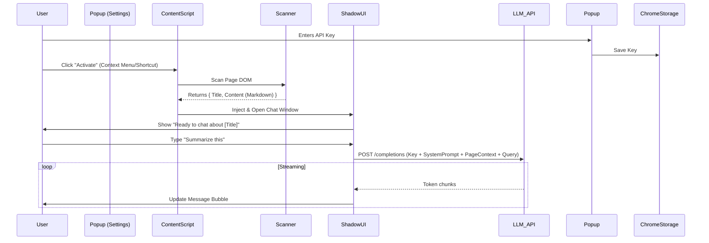

# AI Chatbot Injector — Browser Extension (Custom Engine)

## Goal
Build a cross-browser extension (Chrome/Firefox/Edge) that injects a **custom-built AI chatbot interface** into any webpage. The chatbot will use the page's content as context and communicate directly with LLM providers (OpenAI, Gemini, etc.) using user-supplied API keys.

## Inspiration: Immersive Translate
- **Injection Method**: Use **Shadow DOM** to fully isolate the chatbot UI from the host page's CSS.
- **UI UX**: A floating "bubble" or sidebar that expands into a chat window, similar to Immersive Translate's floating ball.
- **Engine**: Client-side API calls to LLMs, removing the need for a middleware server (like Dify).

## Decisions Made
| Question | Answer |
|----------|--------|
| **Chat Engine** | **Custom Client-Side** (Direct calls to OpenAI/Gemini APIs) |
| **Backend** | None (Serverless/Local-first approach) |
| **Context Method** | Real-time DOM scanning (Text + Metadata) injected into System Prompt |
| **UI Isolation** | **Shadow DOM** (Critical for preventing style bleeds) |
| **Tech Stack** | **Vanilla JS + Web Components** (Lightweight, no heavy framework build steps) |
| **Storage** | `chrome.storage.sync` for API Keys & Preferences |

## Success Criteria
- [ ] Extension loads in Chrome/Firefox/Edge.
- [ ] User can input API Keys (e.g., OpenAI/Gemini) in the Extension Popup/Options.
- [ ] "Scan & Chat" action injects a floating chat bubble into the current page.
- [ ] Chat UI is styled independently of the page (Shadow DOM).
- [ ] Chatbot "knows" the page content (Title, Headings, Main Text) via System Prompt.
- [ ] Streaming responses are supported (real-time typing effect).
- [ ] Markdown rendering in chat responses.

## Tech Stack
| Tech | Purpose |
|------|---------|
| **Manifest V3** | Extension Core |
| **Shadow DOM** | UI Checkboxing/Isolation |
| **Vanilla JS (ES6+)** | Logic (No heavy bundlers like Webpack, keeping it simple) |
| **Marked.js** | Markdown rendering for bot responses |
| **Fetch API** | Streaming requests to LLM endpoints |

## File Structure
```
ai-chatbot-injector/
├── manifest.json
├── _locales/              # Future-proofing for i18n
├── assets/
│   ├── icon16.png
│   ├── icon48.png
│   ├── styles.css         # Chatbot internal styles (injected into Shadow Root)
│   └── chat-template.html # HTML structure for the chat widget
├── lib/
│   ├── marked.min.js      # Markdown parser
│   └── dompurify.min.js   # Security (sanitize HTML)
├── popup/
│   ├── popup.html         # API Key management & Settings
│   ├── popup.css
│   └── popup.js
├── content/
│   ├── content.js         # Entry point
│   ├── shadow-root.js     # Shadow DOM creator & styler
│   ├── scanner.js         # DOM content extractor
│   ├── llm-client.js      # OpenAI/Gemini API handler (Streaming)
│   └── ui-controller.js   # Manages Chat UI events (open/close/send)
├── background/
│   └── service-worker.js  # Context menus, installation events
└── README.md
```

---

## Task Breakdown

### Task 1: Project Skeleton & Manifest
**Agent**: `browser-extension-builder`
- [ ] Create folder structure.
- [ ] Setup `manifest.json` (MV3) with permissions: `activeTab`, `storage`, `scripting`.
- [ ] Add libs (`marked`, `dompurify`) to `lib/`.

### Task 2: Settings & Storage (Popup)
**Agent**: `frontend-specialist`
- [ ] Build `popup.html`: Inputs for API Provider (Dropdown), API Key (Password field), System Prompt Customization.
- [ ] Implement `storage.js` logic to securely save/retrieve keys.
- [ ] **Verify**: Save key -> Close -> Reopen -> Key is loaded.

### Task 3: The Scanner (Context Extractor)
**Agent**: `frontend-specialist`
- [ ] Implement `scanner.js` to intelligently grab "Main Content".
  - Priorities: `article`, `main`, `h1`-`h6`, `p` tags with significant text.
  - Exclude: `nav`, `footer`, `ads`, hidden elements.
- [ ] Format output as a neat Markdown string for the LLM.

### Task 4: The Injector (Shadow DOM UI)
**Agent**: `frontend-specialist`
- [ ] Implement `shadow-root.js`:
  - Create a host element `div#ai-chat-host`.
  - Attach `shadowRoot`.
  - Inject `styles.css` *inside* the shadow root (Crucial for isolation).
  - Render the Chat UI (Input, Send Button, Message Area, Minimize Button).
- [ ] **Verify**: Inject into `example.com`. Modify page CSS (e.g., `* { display: none }`). Chat should remain visible and styled correctly.

### Task 5: LLM Client (The Brain)
**Agent**: `backend-specialist` (Logic heavy)
- [ ] Implement `llm-client.js`:
  - Support generic OpenAI-compatible endpoint structure (`v1/chat/completions`).
  - Handle **Streaming** responses (update UI chunk by chunk).
  - Construct the prompt: `System Instruction + Page Context + User Query`.

### Task 6: Wiring It All Together
**Agent**: `orchestrator`
- [ ] `content.js` listens for "Activate" message.
- [ ] Triggers `scanner.js` -> gets context.
- [ ] Triggers `shadow-root.js` -> shows UI.
- [ ] UI sends message -> `llm-client.js` calls API -> updates UI.

### Task 7: Polish & UX
- [ ] Add "Loading" states.
- [ ] Auto-scroll to bottom of chat.
- [ ] "Clear Chat" button.
- [ ] **Markdown Rendering**: Use `marked.js` to render bot responses (code blocks, lists).

---

## Architecture Diagram (Data Flow)


